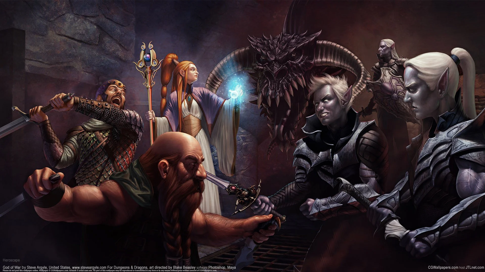
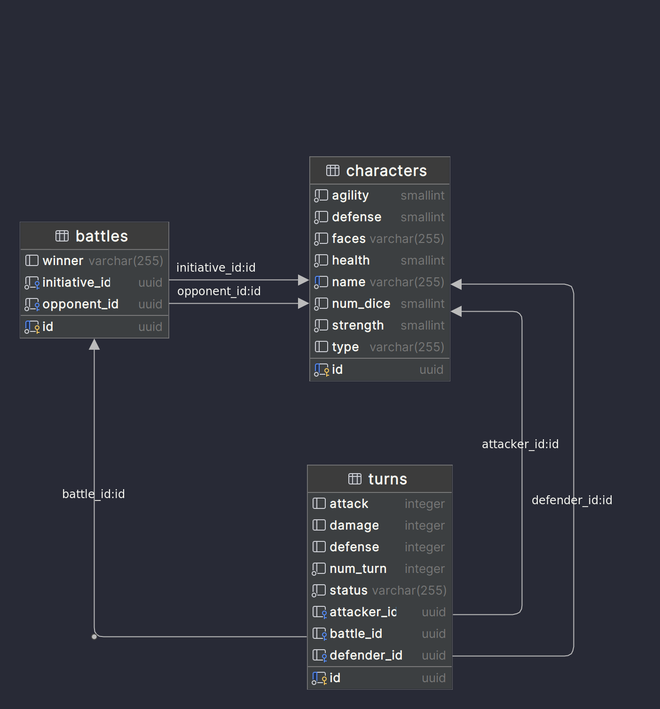
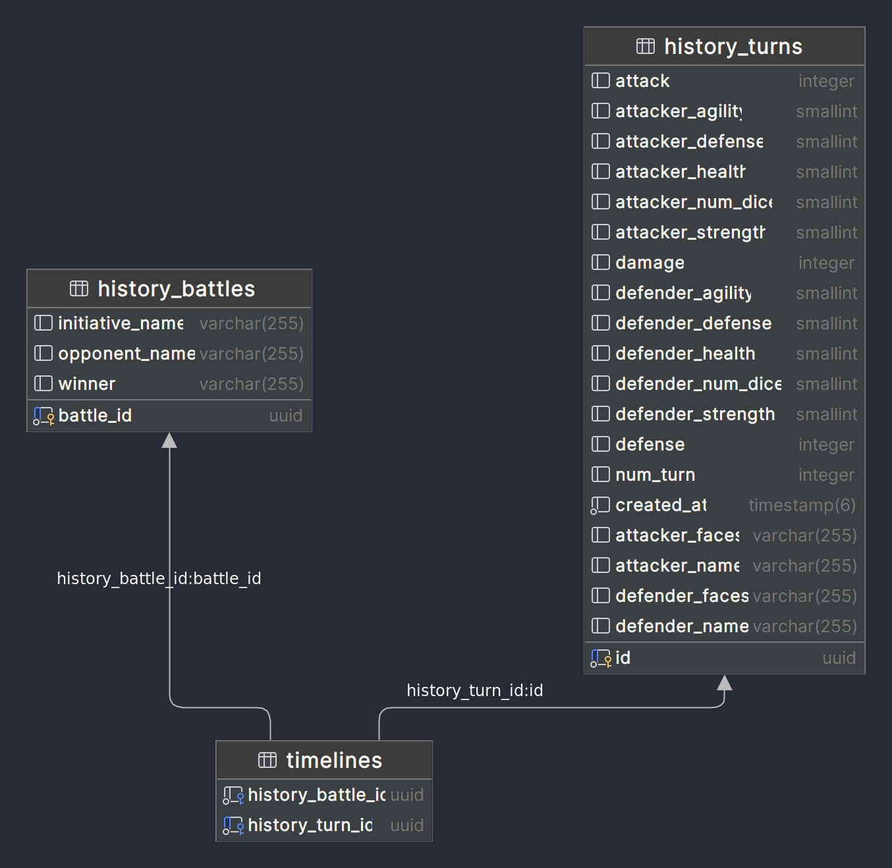

# avanade-projeto-final
# RPG Game API & Log Service



## 📖 Descrição do Projeto

Junte-se à batalha épica estilo Advanced Dungeons & Dragons (AD&D)! Este projeto consiste em uma API RESTful feita com Java SpringBoot para rodar jogos de RPG em turnos, junto com um serviço de log para monitorar as atividades do jogo.

### 🎲 Regras do Jogo

* Escolha entre ser um herói ou monstro.
* Cada personagem tem seus próprios atributos como Vida, Força, Defesa e Agilidade.
* O jogo é decidido em turnos.
* Pontos de Vida (PV) são fundamentais; perder todos os PV resulta em derrota.

## 🚀 Instruções para Rodar o Projeto

### Usando Docker Compose:

1. Clone o repositório principal, que inclui os submódulos:

    ```bash
    git clone --recurse-submodules https://github.com/volneineves/avanade-projeto-final.git
    ```

2. Vá para o diretório do projeto:

    ```bash
    cd avanade-projeto-final
    ```

3. Utilize o Docker Compose para subir os serviços:

    ```bash
    docker-compose up
    ```
4. Aguarde de 30 à 60 segundos à depender de sua internet e seu computador para os serviços carregarem e acesse os [Swagger Api Game](http://localhost:8080/swagger-ui/index.html) ou [Swagger Api Log](http://localhost:8081/swagger-ui/index.html)
5. Caso docker-compose apresente erro, você pode rodar as aplicações em sua IDE preferida, sendo necessário somente que inicie um serviço com rabbitmt na porta 5672 e uma tabela rpg com schemmas game e log na porta 5432.

A API Game rodará na porta 8080 e a API Log na porta 8081.

## ⚙️ Funcionalidades

### API Game:



A API Game é o coração do nosso RPG, responsável por todas as mecânicas e lógicas de jogo. Ela fornece um conjunto abrangente de operações CRUD para gerenciar personagens, além de lidar com toda a dinâmica das batalhas e seus respectivos turnos.

## ✨ Tecnologias Utilizadas

Esse projeto foi desenvolvido com as seguintes tecnologias:

- [Java 17](https://www.oracle.com/java/technologies/javase-jdk17-downloads.html): Linguagem de programação utilizada.
- [Spring Boot](https://spring.io/projects/spring-boot): Framework para facilitar o bootstrapping e o desenvolvimento de novas aplicações Spring.
    - [Spring Data JPA](https://spring.io/projects/spring-data-jpa): Para persistência de dados e manipulação do banco de dados.
    - [Spring Boot Starter Security](https://spring.io/guides/gs/securing-web/): Para funcionalidades relacionadas à segurança, como autenticação e autorização.
    - [Spring Boot Starter Validation](https://spring.io/guides/gs/validating-form-input/): Para validação de dados em formulários e outras entradas.


##### Engine de Batalha:

A API Game RPG tem uma implementação mais complexa, focada na simulação de batalhas e gerenciamento de personagens e turnos.

#### RabbitMQ Publish:

A API Jogo RPG inclui um componente chamado `HistoryPublish` que é responsável por publicar mensagens em filas específicas do RabbitMQ. Os principais tipos de mensagens que são publicadas por essa componente são:

1. **Batalha Criada ou Atualizada**: Quando uma nova batalha é criada na API, `HistoryPublish` publica uma mensagem correspondente nesta fila para informar sobre a criação da nova batalha.
2. **Turno Atualizado**: Quando um turno em uma batalha é atualizado na API, `HistoryPublish` publica uma mensagem nesta fila com detalhes do turno atualizado.

#### Endpoints:

##### CharacterController
* `GET /characters`: Retorna uma lista de todos os personagens.
* `GET /characters/{id}`: Retorna os detalhes de um personagem específico pelo ID.
* `POST /characters`: <span style="color: red; font-weight: bold;">Cria um novo personagem. Atualmente defini que um personagem não pode ter nome igual ao outro já existente, para evitar confusão.</span>
* `PUT /characters/{id}`: Atualiza um personagem existente.
* `DELETE /characters/{id}`: <span style="color: red; font-weight: bold;">Exclui personagens desde que eles não estejam inscritos em uma batalha, a partir disso é gerado um erro.</span>

##### BattleController
* `GET /battles`: Retorna uma lista de todas as batalhas.
* `GET /battles/{id}`: Retorna os detalhes de uma batalha específica pelo ID.
* `POST /battles`: <span style="color: red; font-weight: bold;">Cria uma nova batalha sempre entre monstros vs heróis "rolando os dados" e definindo quem vai ter a iniciativa em todos os turnos subsequentes . Imediatamente após isso, cria o primeiro turno, que é disponibilizado no corpo da mesma requisição.</span>

##### TurnController
**Obs1.: Utilizar id do turno gerado na criação da Batalha ou após o cálculo do dano gerar um turno novo, caso a batalha não tenha existido um vencedor.**  
**Obs2.: Sempre o primeiro a atacar ou defender, será o jogador que foi beneficiado com a iniciativa.**
* `GET /turns`: Retorna uma lista de todos os turnos com base em um filtro.
* `GET /turns/{id}`: Retorna os detalhes de um turno específico pelo ID.
* `PATCH /turns/{id}/attack`: <span style="color: red; font-weight: bold;">Executa um ataque durante o turno.</span>
* `PATCH /turns/{id}/defend`: <span style="color: red; font-weight: bold;">Executa uma defesa durante o turno.</span>
* `PATCH /turns/{id}/calculate-damage`: <span style="color: red; font-weight: bold;">Somente após terem o atacante e o defensor definido, é calculado o dano e descontado se necessário na vida. Após isso, se a vida estive igual ou abaixo de 0, é finalizado a batalha junto ao turno, caso contrário, é finalizado o turno e um outro iniciado, voltando ao loop incial para definir o atacante e o defensor.</span>

#### Implementação de Cache no `CharacterController`:

A classe `CharacterController` inclui capacidades básicas de cache, principalmente para fins experimentais.

As anotações `@Cacheable` e `@CacheEvict` do Spring Framework são usadas para gerenciar o comportamento do cache.

- **@Cacheable**: Os métodos `getAll()` e `getById(@PathVariable UUID id)` estão anotados com `@Cacheable`, o que significa que o resultado dessas operações será armazenado em cache. Isso ajuda a reduzir o tempo de resposta e a carga no banco de dados para solicitações subsequentes idênticas.

- **@CacheEvict**: Os métodos `create(@RequestBody @Valid CharacterRequest request)`, `update(@PathVariable UUID id, @RequestBody CharacterRequest updatedCharacter)` e `delete(@PathVariable UUID id)` estão anotados com `@CacheEvict`. Essa anotação garante que o cache será invalidado quando um novo personagem for criado, atualizado ou excluído, garantindo assim que os dados em cache permaneçam atualizados.

Para mais informações sobre os endpoints, consulte a [Documentação Swagger](http://localhost:8080/swagger-ui/index.html).

### API Log:



A API Log tem uma implementação mais básica, focada na versatilidade e eficácia da integração com o RabbitMQ. Em resumo ela possui um `Listener` que consome mensagens das filas do RabbitMQ e as registra em um banco de dados.

#### RabbitMQ Listener:

A API Log inclui um `HistoryListener` que fica à escuta de mensagens provenientes de filas específicas do RabbitMQ. O Listener é responsável por processar dois tipos principais de mensagens:

1. **Batalha Criada**: Quando uma nova batalha é criada na API do Jogo, uma mensagem é enviada para esta fila. O Listener deserializa a mensagem e registra a nova batalha no banco de dados.
2. **Batalha Atualizada**: Quando uma nova batalha é atualizada na API do Jogo, uma mensagem é enviada para esta fila novamente. O Listener deserializa a mensagem e classe service se responsabiliza para processar se essa mensagem é nova e pode ou não ser atualizada.
3. **Turno Atualizado**: Quando um turno é atualizado na API do Jogo, uma mensagem correspondente é enviada para esta fila. O Listener deserializa a mensagem e atualiza o registro da batalha correspondente no banco de dados com os detalhes do turno. Um detalhe interessante, é que ele é salvo em uma espécie de timeline, bastando haver qualquer alteração lá, a timeline é acrecida aqui

#### Endpoints:

* `GET /history-battles`: Retorna uma lista de todas as batalhas registradas.
* `GET /history-battles/{id}`: Retorna os detalhes de uma batalha específica pelo ID.

Para mais informações sobre os endpoints, consulte a [Documentação Swagger](http://localhost:8081/swagger-ui/index.html).

#### Proposta

Para entender um pouco mais da proposta do desafio oferecido pela ADA e pela Avanade, consulte [Proposta de API](https://github.com/volneineves/avanade-projeto-final/blob/main/assets/challenge.pdf).

## 📄 Licença

Este projeto está sob a licença MIT.
